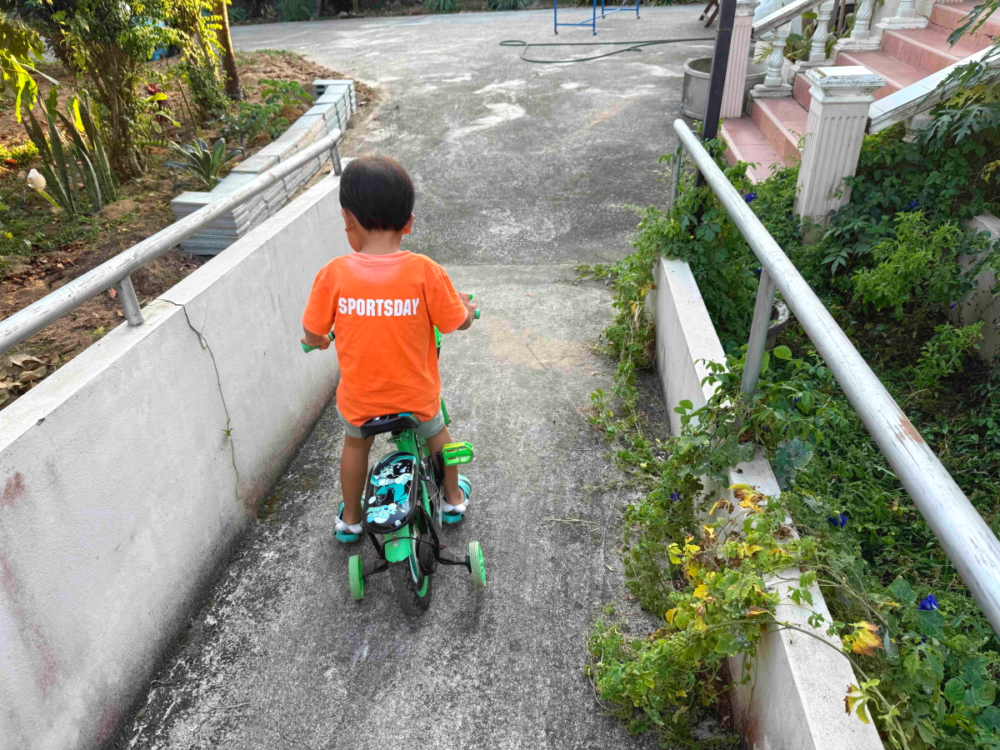

# 20250123

<html>
<head>

<meta charset="UTF-8">
<meta http-equiv="Content-Type" content="text/html; charset=UTF-8">
<meta http-equiv="X-UA-Compatible" content="IE=EmulateIE10" />
<meta http-equiv="X-UA-Compatible" content="IE=edge">

<!--ここから上はお決まりの定型文です-->

<!--ここからが表現の書式などを決めるcssという部分-->

<link href="https://cdnjs.cloudflare.com/ajax/libs/lightbox2/2.7.1/css/lightbox.css" rel="stylesheet">

</head>

<body>

モバイル端末をお使いの場合は、画面を横向きにすると
より見やすくご覧頂けます。

<!--ここ上は、ほぼそのまま使います！-->

<!--QRコードの挿入例-->

 アクセス用QRコード

<marquee direction="left" scrollamount="20" width="30%">(^_^)/~alis</marquee>

<!--流れ文字の挿入例-->
<h1><marquee behavior="left">!!! 2025/01/23、修理したPCで映画鑑賞して最後は満点の星空!!!</marquee></h1>

                          

<!--ここから下が、本体部分-->

<h2>お月様と太陽のなす角が90度を切ったので同じ朝焼けに収まります 23日 朝6:44</h2>

<h2>陽射しとともにハスのお花もお目覚め</h2>

<h2>修理したPCで映画鑑賞</h2>

<h2>ヒロインはナチスに超能力開発された日系三世の女性</h2>

<h2>映画の作成は、今渦中のフジテレビ 画像クリックで映画のあらすじ説明に飛びます ↓</h2>

<h2>今日もお洗濯物は青空の下であっという間に乾きます</h2>

<h2>夕陽の中で木に水を上げたら虹が見えました 画像クリックで動画再生します ↓</h2>

<h2>上りをクリアしたちびちゃん、今日は下りの練習</h2>

<h2>毎日見ても見飽きない夕焼けグラデーション(3枚も撮っちゃいました)</h2>

<h2>先日BGMに使ったパッヘルベルのカノン、別バージョンがありました 300年以上も前の曲ですが今聴いてもいいですね〜</h2>
<iframe width="560" height="315" src="https://www.youtube.com/embed/vJhlvC6-7i0?si=xI-23xcl1NM9JWUr" title="YouTube video player" frameborder="0" allow="accelerometer; autoplay; clipboard-write; encrypted-media; gyroscope; picture-in-picture; web-share" referrerpolicy="strict-origin-when-cross-origin" allowfullscreen></iframe> 

<h2>締めくくりは、北緯20度付近で見えた「冬のダイアモンド」</h2>

   
<h2>以上、嗜好を変えて朝焼けのお月様からスタート。 修理したPCで映画鑑賞、最後は満点の星空でした。 ここまで観ていただきありがとうございました。</h2>

     
<h2>
<a href="https://torokoid.github.io/20241126_chiangrai/" target="_blank">Back to the menu page</a>
</h2>

   

         

  

      

<!--本体はここまで-->

<!--画面に空白地帯を作って、背景が見えるようにしています-->
                                              

<!-- フッタ -->
<footer>

Copyright 2025/01/24 alis @ChiangRai

</footer>

<!--HPにさまざまなJavaScriptを呼び込むための書式-->

